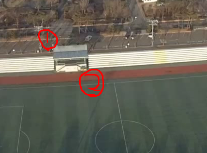
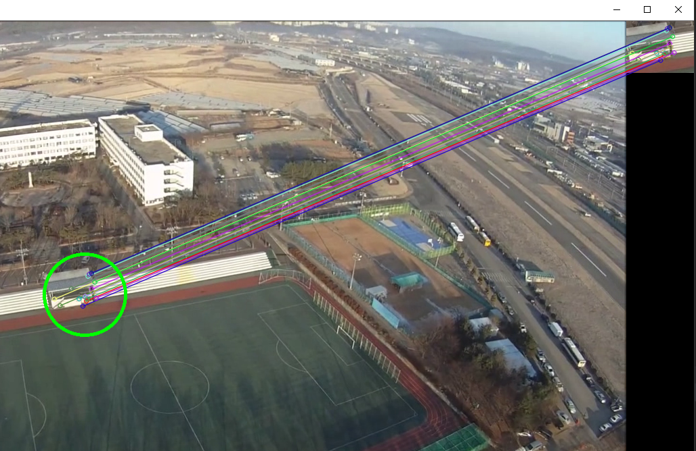
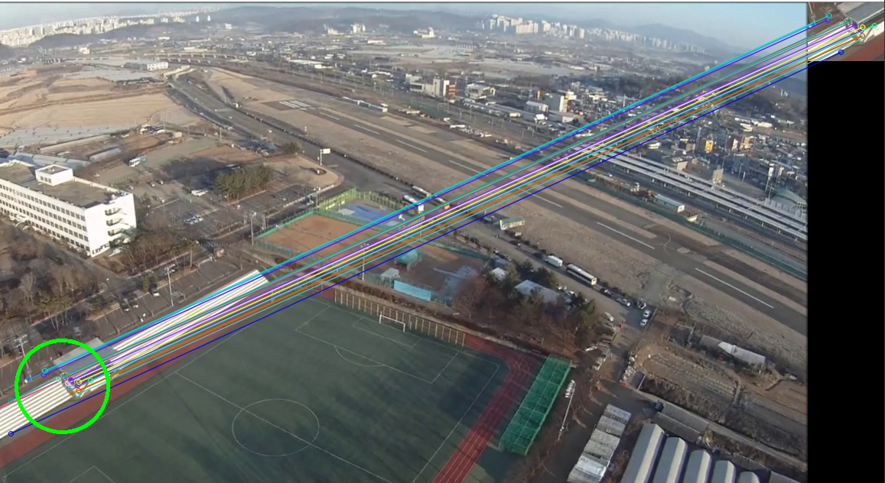

# opencv_object_detection_in_video

2019/5/27~5/28

먼저, numpy, matplotlib, opencv를 설치해주세요
특히 opencv의 경우, 특정 버전 이후로는 해당 코드가 작동하지 않을 수 있습니다.   
```cv2.xfeatures2d.SIFT_create()``` 의 경우 3.4.2.16 까지만 작동되고 그 이후는 deprecated되었습니다.   

따라서 다음과 같이 설치해주세요   
```pip install numpy```   
```pip install matplotlib```   
```pip install opencv-python==3.4.2.16```   
```pip install opencv-contrib-python==3.4.2.16```

opencv를 통해서 만든 object detection 입니다.
video들 예시로 몇 개를 두었습니다.

사용 방법입니다.

먼저 다음의 스크린샷 처럼 1, 2를 눌러 주세요. 그 다음 enter키를 누르시면 됩니다.


  그러면 다음과 같이 object_detection을 합니다.

동영상이 진행됨에 따라 object_detection의 기준이 되는 이미지가 계속해서 변합니다.


종료를 원하시면 esc버튼을 누르시면 됩니다.
